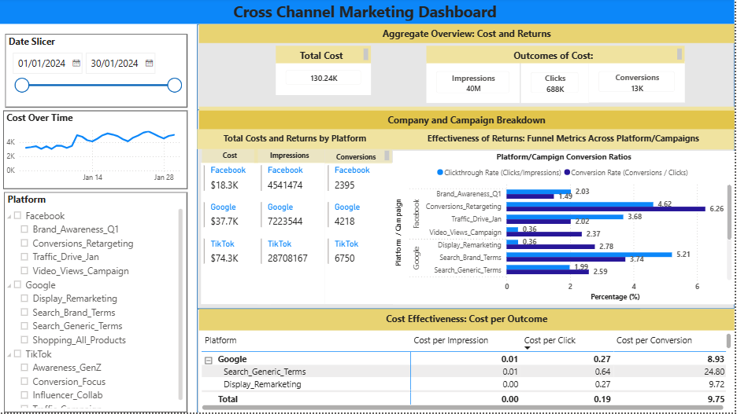

# Marketing Campaign KPI Tracking

This dashboard is designed to track campaign performance across Facebook, Google, and TikTok over January 2026.

The dashboard is intended to:
1. support high-level monitoring by summarizing total spend and campaign outcomes
2. enable deeper analysis of platform- and campaign-level performance
3. highlight cost-efficiency metrics to inform future budget allocation decisions

## Methodology

### Tools
- Snowflake SQL
- Power BI

### Data preparation
Advertising exports from Facebook, Google, and TikTok were standardized into a unified schema with shared campaign KPIs and platform-specific metrics. The resulting dataset was then visualized in Power BI to support cross-platform performance analysis.

## Dashboard

## Dashboard layout
- **Left panel:** interactive filters for date, platform, and campaign selection
- **Main panel:** high-level KPI summaries, platform/campaign comparisons, funnel metrics, and cost-efficiency analysis
